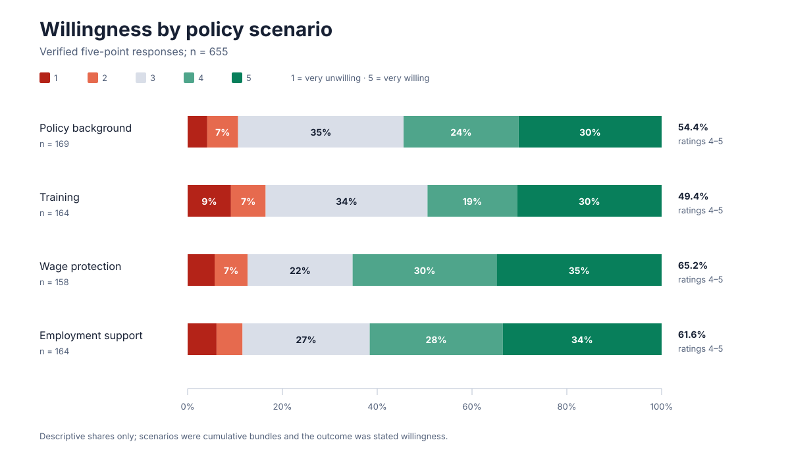
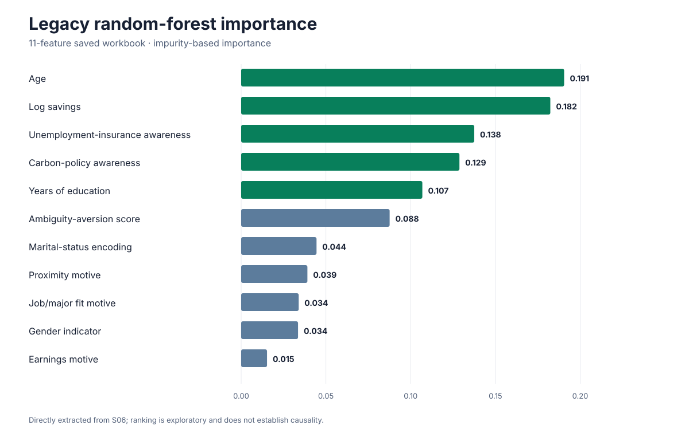

# Coal Workers' Willingness to Retrain for Renewable-Energy Jobs

### Survey design, quantitative analysis and findings from a 2022–2023 undergraduate study

[](https://github.com/jetfan-xin/just-transition-reskilling/actions/workflows/verify.yml)

An energy transition is also a workforce transition. This undergraduate research project examined how training support, income security and employment prospects relate to coal workers' stated willingness to retrain for renewable-energy jobs.

Conducted at **Renmin University of China in 2022–2023**, the team combined a four-arm online survey experiment with regression analysis, exploratory random forests and analysis of workers' written responses. The retained dataset contains **655 valid responses** from coal workers in Shaanxi, China.



## My contribution

I am **Jingfan Xin**, a member of the research team. My main responsibilities were **quantitative-method research and design, data processing and analysis**.

- Researched and designed quantitative methods for analysing retraining willingness.
- Organised, cleaned and prepared survey data for statistical analysis.
- Implemented Python random forest models and performed regression analysis to examine factors associated with retraining willingness.

The midterm report records my role in data analysis and model construction, including logistic stepwise regression. [Contribution evidence](docs/PROVENANCE.md)

## Study design

Participants received one of four cumulative hypothetical policy bundles and rated their willingness on a five-point scale.

| Scenario | Information presented | n | Ratings 4–5 |
| --- | --- | ---: | ---: |
| Policy background | Energy-transition policy and renewable-sector context | 169 | 54.4% |
| Training | Background plus a free three-month training course | 164 | 49.4% |
| Wage protection | Training plus continued payment of the previous wage | 158 | 65.2% |
| Employment support | Training and wage protection plus a job after completion | 164 | 61.6% |

These are unadjusted descriptive shares. The outcome is stated willingness, not training attendance or later employment. [Study design and sample flow](docs/STUDY_DESIGN.md)

## Real outputs preserved here

The repository now includes source-linked, non-identifying outputs rather than documentation alone:

- [Exact random-forest console output](results/legacy-random-forest-output.txt) retained byte-for-byte from the archive.
- [Saved 11-feature importance values](results/random-forest-feature-importance-11.csv) and the [embedded original plot](figures/legacy-random-forest-feature-importance-11.png), extracted from the results workbook without its author metadata or local file path.
- [Open-text reason categories](results/open-text-reason-categories.csv), extracted from the final report's cached chart data, with Chinese labels, English translations, counts and shares.
- [Original policy-awareness boxplot](figures/legacy-policy-awareness-boxplot.png) and positive/negative [word-cloud figures](figures/README.md), extracted from the final report.
- A deterministic [random-forest sensitivity audit](results/replication-random-forest-metrics.json) with held-out [permutation importance](results/replication-random-forest-permutation-importance.csv). It is a modern reproducibility check and is not presented as the missing historical implementation.



## Reproducible workflow

The public checks and figure build use only the Python standard library:

```bash
make verify
make figures
```

Archive owners can reproduce the aggregate survey summary and sanitized legacy extracts by providing private source paths locally:

```bash
python3 scripts/derive_survey_summary.py PRIVATE_MERGED_EXPORT.csv \
  --output results/survey-summary.json

python3 scripts/extract_legacy_outputs.py \
  --report PRIVATE_FINAL_REPORT.docx \
  --workbook PRIVATE_RESULTS_WORKBOOK.xlsx \
  --random-forest-log PRIVATE_MODEL_OUTPUT.txt
```

The deterministic model audit uses the pinned environment in `requirements-replication.txt`:

```bash
uv run --with-requirements requirements-replication.txt \
  python scripts/reproduce_random_forest.py PRIVATE_CONTROL_EXPORT.csv
```

No command prints respondent rows or exports individual predictions. [Data and reproducibility details](docs/DATA_AND_REPRODUCIBILITY.md)

## Findings and limits

Income continuity during retraining and uncertainty about future work emerged as practical concerns. The wage-protection scenario had a higher observed willingness share than the training-only scenario, while the cumulative bundles did not produce a monotonic pattern. Open-text categories likewise emphasised development prospects among willing respondents and loss of income security among unwilling respondents.

Saved model artifacts disagree about performance and lack the original training script, split definitions and environment. The repository therefore keeps each historical result version separate and labels the deterministic audit as a sensitivity analysis. Feature importance is exploratory and does not establish causality. [Methods, findings and model audit](docs/METHODS_AND_FINDINGS.md)

## Privacy and attribution

Respondent-level spreadsheets, free-text answers, interview records, contact details, signatures and third-party publications are excluded. The original report and workbook are also excluded; only reviewed aggregate values and non-identifying embedded figures are published. `scripts/check_public_release.py` enforces these boundaries in CI.

The original research was collaborative. Repository maintenance does not imply sole ownership of team materials, and no blanket open-source licence is asserted for them. [Provenance and sharing](docs/PROVENANCE.md)
