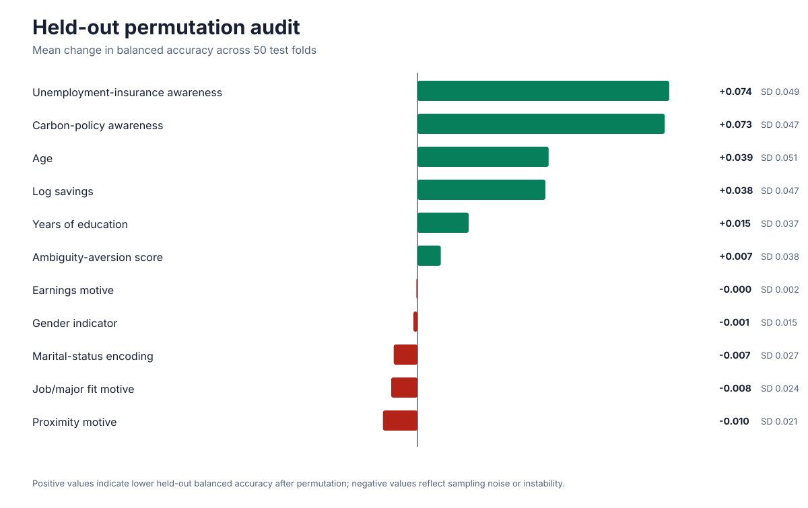
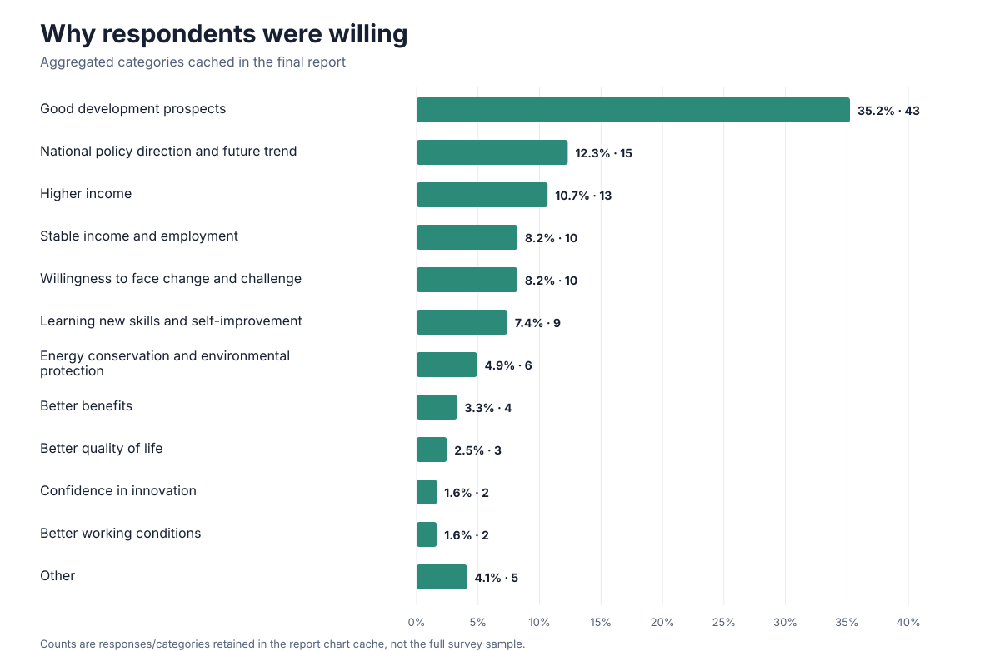
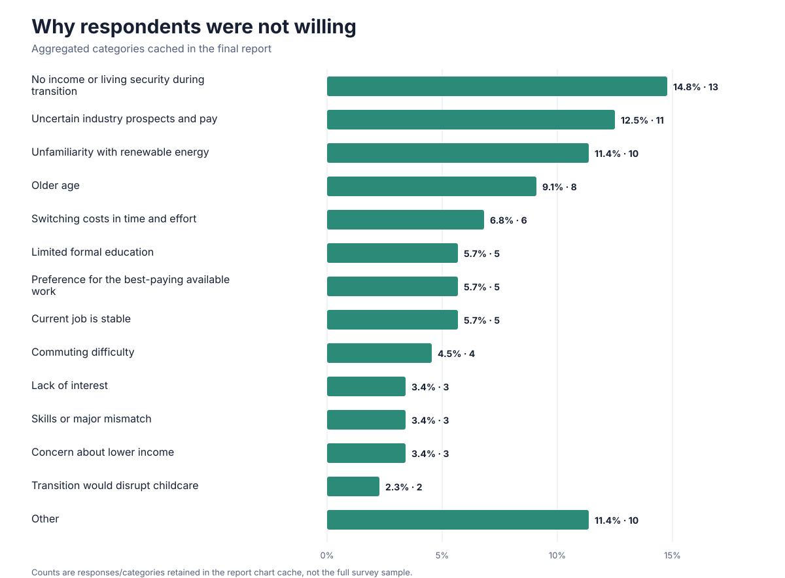

# Methods and findings

This document distinguishes **historical report statements**, **saved model outputs**, **retrospective aggregate checks** and a **deterministic sensitivity analysis**. The reconstructed scripts are not presented as the missing original implementation.

## 1. Survey preparation

The midterm report records questionnaire design, spreadsheet organisation, manual plausibility review and cleaning with Excel and Stata, assisted by Python. The final report describes exclusions involving eligibility, age and logical inconsistencies. Earlier cleaning instructions differ from the final report; they are evidence of the workflow, not a complete executable specification. [S01, S02, S07](PROVENANCE.md)

## 2. Verified descriptive responses

The counts below were recomputed from S08 with [`derive_survey_summary.py`](../scripts/derive_survey_summary.py). Records with a numeric survey-order field were retained; all 655 had exactly one populated scenario response. One non-record row had neither an order identifier nor a scenario response and was excluded. No participant-level record is redistributed.

| Scenario | Very unwilling | Unwilling | Undecided | Willing | Very willing | Total | Ratings 4–5 |
| --- | ---: | ---: | ---: | ---: | ---: | ---: | ---: |
| Policy background | 7 | 11 | 59 | 41 | 51 | 169 | 54.4% |
| Training | 15 | 12 | 56 | 31 | 50 | 164 | 49.4% |
| Wage protection | 9 | 11 | 35 | 48 | 55 | 158 | 65.2% |
| Employment support | 10 | 9 | 44 | 46 | 55 | 164 | 61.6% |

These are descriptive proportions, not fitted marginal effects or evidence about realised employment. Wage protection had a higher observed willingness share than training alone. Employment support was not the highest group, so the pattern is not a monotonic benefit from every added feature.

## 3. Regression analysis

The final report uses binary Probit models for policy-scenario differences and ordered logistic regression for the control-group willingness outcome. The latter considers savings, education, policy and insurance awareness, employment reasons, ambiguity aversion and demographic controls. [S01, sections 3.3–3.4](PROVENANCE.md)

The report interprets income continuity during training as important and discusses associations involving savings, age and awareness of transition-related policies. Some significance statements in the narrative are inconsistent, and the full estimation workflow is unavailable. No selected coefficient or p-value is promoted here as an independently verified headline result.

**Interpretation correction:** a Probit coefficient is not a percentage-point probability change. Probability-scale comparisons require predicted probabilities or marginal effects with an explicit evaluation rule. The archived report's probability-style readings of raw coefficients are not repeated as findings. See the official [statsmodels marginal-effects documentation](https://www.statsmodels.org/stable/generated/statsmodels.discrete.discrete_model.ProbitResults.get_margeff.html). This reference clarifies interpretation; it does not establish that statsmodels was used in the original study.

## 4. Random forests

S01 and S04 describe a Python/scikit-learn random forest with 100 trees and impurity-based feature importance. Its role was exploratory: examine potentially nonlinear associations alongside regression, not deliver an employment prediction service.

### Saved historical outputs

| Artifact | Accuracy | AUC | F1 | Status |
| --- | ---: | ---: | ---: | --- |
| Final report and methods note (S01, S04) | 0.645 | 0.707 | Not stated | Narrative-reported |
| [Saved 32-feature output log](../results/legacy-random-forest-output.txt) (S05) | 0.432 ± 0.060 | 0.538 ± 0.057 | 0.314 ± 0.069 | Exact retained output |
| [Saved 11-feature workbook extract](../results/random-forest-feature-importance-11.csv) (S06) | 0.445 ± 0.124 | 0.557 ± 0.096 | 0.329 ± 0.101 | Directly extracted values |

These rows must not be combined as one experiment. Their targets, averaging conventions, random states and run lineage are not fully documented. The higher report numbers are not independently reproduced.

The 11-feature workbook ranks age, log savings, insurance awareness, carbon-policy awareness and education highest. Its carbon-policy value is 12.9%, while the report prose states 13.8%; the discrepancy remains unresolved. Impurity importance may favour high-cardinality variables and does not establish causality.

### Deterministic sensitivity analysis

[`reproduce_random_forest.py`](../scripts/reproduce_random_forest.py) evaluates the 153-row S09 control sample using 5-fold cross-validation repeated 10 times, a fixed seed, a most-frequent baseline and held-out permutation importance.

| Model | Accuracy | Balanced accuracy | Macro F1 | Macro OvR AUC |
| --- | ---: | ---: | ---: | ---: |
| Random forest | 0.446 ± 0.075 | 0.337 ± 0.065 | 0.331 ± 0.071 | 0.637 ± 0.076 |
| Most-frequent baseline | 0.347 ± 0.020 | 0.200 ± 0.000 | 0.103 ± 0.005 | 0.500 ± 0.000 |

The sensitivity analysis confirms that the task is difficult and the sample is imbalanced. Its accuracy and macro F1 are close to the saved 11-feature values, while the AUC differs because the validation and averaging rule are now explicit. These metrics are not a reconstruction of the undocumented historical run.

Insurance awareness and carbon-policy awareness have the largest mean held-out permutation scores in this audit, followed by age and log savings. Between-split variability is large, so the ranking should be treated as unstable exploratory evidence.

Methodological corrections applied in the audit:

- Repeated stratified K-fold validation replaces the ambiguous “10-fold stratified bootstrap” label.
- Five folds ensure that the rarest outcome class, with five observations, appears in every test fold.
- Tree inputs are not Z-score scaled because tree splits do not require it.
- Balanced accuracy, macro F1 and macro one-vs-rest AUC make the five-class evaluation rule explicit.
- Held-out permutation importance supplements the saved impurity importance.

See [scikit-learn cross-validation guidance](https://scikit-learn.org/stable/modules/cross_validation.html), [decision-tree guidance](https://scikit-learn.org/stable/modules/tree.html) and the official [importance-method comparison](https://scikit-learn.org/stable/auto_examples/inspection/plot_permutation_importance.html).

## 5. Open-text analysis and interviews

The report describes jieba tokenisation, TF-IDF keyword extraction and K-means clustering of short written reasons, followed by iterative manual consolidation. The final categories were not an untouched K-means output. [S01, section 4.1](PROVENANCE.md)

Cached chart data in S01 preserves 122 willing-reason assignments and 88 unwilling-reason assignments. The largest willing category is good development prospects (43, 35.2%). The leading unwilling categories are no income/living security during transition (13, 14.8%), uncertain industry prospects and pay (11, 12.5%), and unfamiliarity with renewable energy (10, 11.4%).

| Willing reasons | Unwilling reasons |
| --- | --- |
|  |  |

The [bilingual category table](../results/open-text-reason-categories.csv) contains every cached label, count and recalculated share. The original [positive](../figures/legacy-positive-reasons-wordcloud.png) and [negative](../figures/legacy-negative-reasons-wordcloud.png) word clouds are preserved without respondent text. Tokeniser settings, sentence assignments and interview coding files were not located. Quotes and recordings remain private.

## Practical outcome

The project framed transition support around workers' financial constraints, information needs and employment uncertainty. It does not demonstrate a deployed training programme, realised employment gains or a production-grade predictive model.
